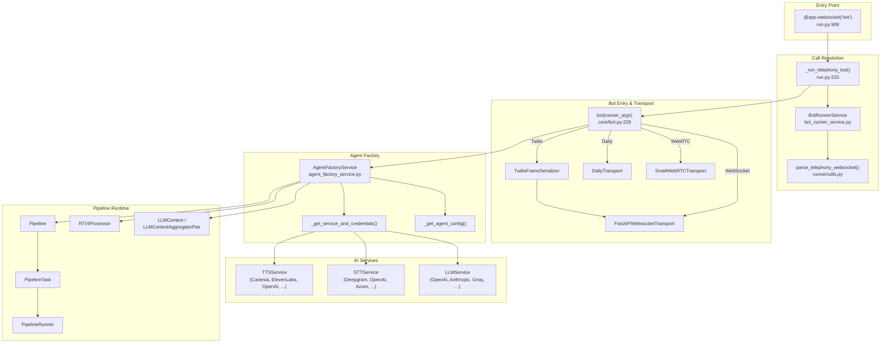
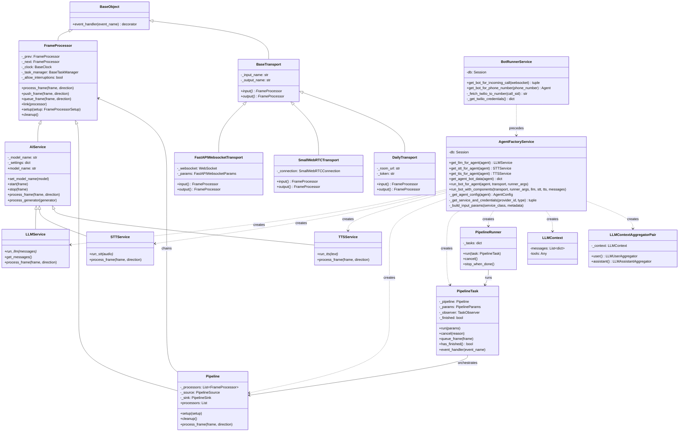
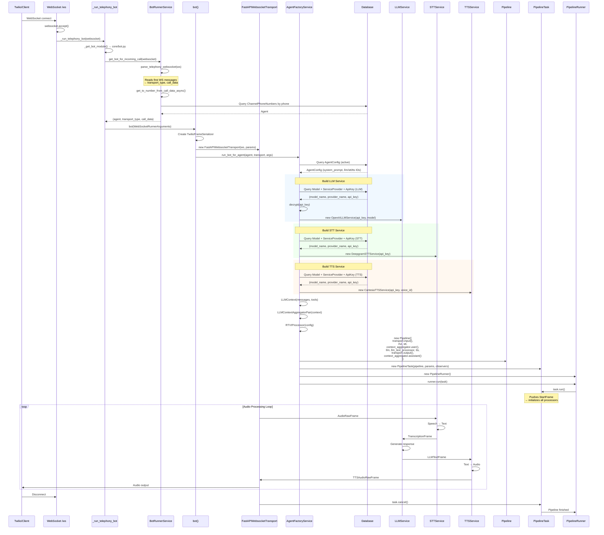
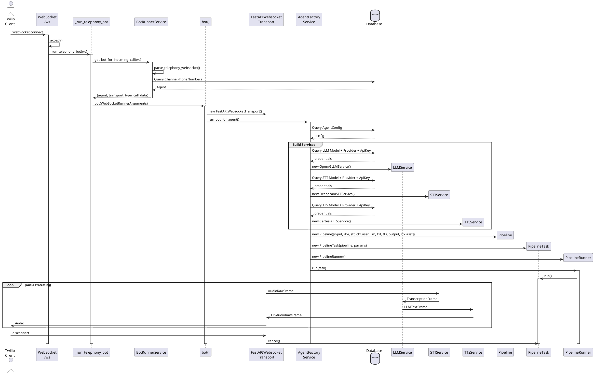
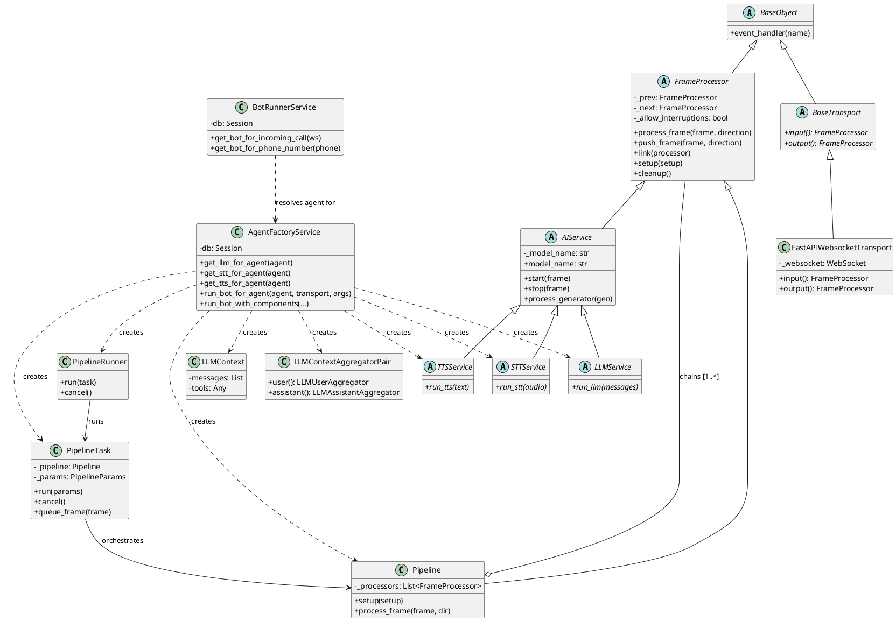

# Agent Pipeline Execution Architecture

## Overview

This document describes the runtime architecture of the Tone voice agent pipeline, tracing execution from the WebSocket entry point (`/ws`) through pipeline creation, agent initialization, and LLM/STT/TTS provider instantiation.

---

## 1. Call Chain from `/ws` to Pipeline Execution

```
@app.websocket("/ws")                              # run.py:908
  └─ websocket.accept()
  └─ _run_telephony_bot(websocket)                  # run.py:233
       └─ _get_bot_module()                         # run.py:127 → resolves core/bot.py
       └─ BotRunnerService(db)
            .get_bot_for_incoming_call(websocket)    # bot_runner_service.py:126
            ├─ parse_telephony_websocket(websocket)  # Reads first WS messages → (transport_type, call_data)
            ├─ get_to_number_from_call_data_async()  # Resolves "to" phone number (Twilio API)
            └─ get_bot_for_phone_number(to_number)   # DB lookup: phone → ChannelPhoneNumbers → Agent
       └─ WebSocketRunnerArguments(websocket, body={call_data, transport_type, agent})
       └─ bot_module.bot(runner_args)                # core/bot.py:228
            └─ isinstance check → WebSocketRunnerArguments
            └─ TwilioFrameSerializer(stream_sid, call_sid, ...)
            └─ FastAPIWebsocketTransport(websocket, params)  # Transport created
            └─ run_bot(transport, runner_args)        # core/bot.py:124
                 └─ AgentFactoryService(db)
                      .run_bot_for_agent(agent, transport, runner_args)  # agent_factory_service.py:639
                      ├─ get_agent_bot_data(agent)                       # agent_factory_service.py:533
                      │   ├─ _get_agent_config(agent)       # DB: AgentConfig (active)
                      │   ├─ get_llm_for_agent(agent)       # → LLMService instance
                      │   │   ├─ _get_service_and_credentials(llm_service_id, "llm")
                      │   │   │   ├─ DB: Model + ServiceProvider join
                      │   │   │   └─ DB: ApiKey → decrypt()
                      │   │   └─ Provider switch → instantiate (OpenAILLMService, AnthropicLLMService, ...)
                      │   ├─ get_stt_for_agent(agent)       # → STTService instance
                      │   │   └─ Same pattern as LLM
                      │   └─ get_tts_for_agent(agent)       # → TTSService instance
                      │       └─ Same pattern as LLM
                      └─ run_bot_with_components(transport, runner_args, llm, stt, tts, messages)
                           ├─ LLMContext(messages, tools)
                           ├─ LLMContextAggregatorPair(context)
                           ├─ LLMTextProcessor()
                           ├─ RTVIProcessor(config)
                           ├─ Pipeline([                          # agent_factory_service.py:597
                           │    transport.input(),                 # BaseInputTransport
                           │    rtvi,                              # RTVIProcessor
                           │    stt,                               # STTService
                           │    context_aggregator.user(),         # LLMUserAggregator
                           │    llm,                               # LLMService
                           │    llm_text_processor,                # LLMTextProcessor
                           │    tts,                               # TTSService
                           │    transport.output(),                # BaseOutputTransport
                           │    context_aggregator.assistant(),    # LLMAssistantAggregator
                           │ ])
                           ├─ PipelineTask(pipeline, params, observers)
                           ├─ PipelineRunner(handle_sigint=False)
                           └─ runner.run(task)                     # Blocking until pipeline ends
```

---

## 2. High-Level Architecture Diagram (Mermaid)




---

## 3. UML Class Diagram (Mermaid)




---

## 4. UML Sequence Diagram (Mermaid)




---

## 5. Data Flow Through the Pipeline

```
┌──────────────────────────────────────────────────────────────────────┐
│                        Pipeline Frame Flow                          │
│                                                                     │
│  ┌─────────────┐    ┌──────┐    ┌─────┐    ┌───────────────┐       │
│  │ transport    │───▶│ RTVI │───▶│ STT │───▶│ context_agg   │       │
│  │  .input()   │    │      │    │     │    │   .user()     │       │
│  │             │    │      │    │     │    │               │       │
│  │ AudioRaw    │    │      │    │Trans│    │ LLMContext    │       │
│  │ Frame       │    │      │    │crip.│    │ (messages)    │       │
│  └─────────────┘    └──────┘    └─────┘    └───────┬───────┘       │
│                                                     │               │
│                                                     ▼               │
│  ┌─────────────┐    ┌──────────┐    ┌─────┐    ┌───────────┐       │
│  │ context_agg │◀───│transport │◀───│ TTS │◀───│    LLM    │       │
│  │ .assistant()│    │ .output()│    │     │    │           │       │
│  │             │    │          │    │     │    │ LLMText   │       │
│  │ Updates     │    │ TTSAudio │    │Audio│    │ Frame     │       │
│  │ context     │    │ RawFrame │    │     │    │           │       │
│  └─────────────┘    └──────────┘    └─────┘    └───────────┘       │
│                          │                                          │
│                          ▼                                          │
│                    WebSocket/Client                                  │
└──────────────────────────────────────────────────────────────────────┘
```

---

## 6. Class Hierarchy

```
BaseObject
├── FrameProcessor
│   ├── AIService
│   │   ├── LLMService
│   │   │   ├── OpenAILLMService / BaseOpenAILLMService
│   │   │   ├── AnthropicLLMService
│   │   │   ├── GroqLLMService
│   │   │   ├── GoogleLLMService
│   │   │   ├── OLLamaLLMService
│   │   │   ├── AWSBedrockLLMService
│   │   │   └── OpenRouterLLMService
│   │   ├── STTService
│   │   │   ├── DeepgramSTTService
│   │   │   ├── OpenAISTTService
│   │   │   ├── GroqSTTService
│   │   │   ├── AzureSTTService
│   │   │   ├── GoogleSTTService
│   │   │   ├── CartesiaSTTService
│   │   │   ├── ElevenLabsRealtimeSTTService
│   │   │   ├── AssemblyAISTTService
│   │   │   └── SpeechmaticsSTTService, SonioxSTTService, ...
│   │   └── TTSService
│   │       ├── CartesiaTTSService
│   │       ├── ElevenLabsTTSService
│   │       ├── OpenAITTSService
│   │       ├── DeepgramHttpTTSService
│   │       ├── AzureTTSService
│   │       ├── PlayHTTTSService
│   │       ├── HumeTTSService
│   │       └── RimeHttpTTSService, SarvamHttpTTSService, ...
│   ├── LLMTextProcessor
│   ├── LLMUserAggregator
│   ├── LLMAssistantAggregator
│   ├── RTVIProcessor
│   ├── PipelineSource
│   └── PipelineSink
├── BaseTransport
│   ├── FastAPIWebsocketTransport   (Telephony: Twilio, Telnyx, Plivo)
│   ├── SmallWebRTCTransport        (Browser WebRTC)
│   └── DailyTransport              (Daily.co rooms)
├── Pipeline (extends FrameProcessor)
├── PipelineTask (extends BasePipelineTask)
└── PipelineRunner
```

---

## 7. Core Class Responsibilities

### Entry & Routing Layer


| Class                  | File                                     | Responsibility                                                            |
| ---------------------- | ---------------------------------------- | ------------------------------------------------------------------------- |
| `_run_telephony_bot()` | `pipecat/src/pipecat/runner/run.py:233`  | Receives WebSocket, resolves agent via BotRunnerService, invokes `bot()`  |
| `BotRunnerService`     | `core/services/bot_runner_service.py:15` | Parses telephony WebSocket messages, resolves phone number → Agent via DB |
| `bot()`                | `core/bot.py:228`                        | Creates transport based on runner argument type, calls `run_bot()`        |


### Factory Layer


| Class                            | File                                        | Responsibility                                                                                              |
| -------------------------------- | ------------------------------------------- | ----------------------------------------------------------------------------------------------------------- |
| `AgentFactoryService`            | `core/services/agent_factory_service.py:22` | Central factory: reads agent config from DB, builds LLM/STT/TTS instances, constructs and runs the pipeline |
| `_get_agent_config()`            | `agent_factory_service.py:25`               | Queries `AgentConfig` table for the active config of an agent                                               |
| `_get_service_and_credentials()` | `agent_factory_service.py:37`               | Joins Model + ServiceProvider + ApiKey, decrypts API key                                                    |
| `get_llm_for_agent()`            | `agent_factory_service.py:101`              | Maps provider name → concrete LLMService subclass                                                           |
| `get_stt_for_agent()`            | `agent_factory_service.py:183`              | Maps provider name → concrete STTService subclass                                                           |
| `get_tts_for_agent()`            | `agent_factory_service.py:255`              | Maps provider name → concrete TTSService subclass                                                           |


### Transport Layer


| Class                       | File                                              | Responsibility                                                                    |
| --------------------------- | ------------------------------------------------- | --------------------------------------------------------------------------------- |
| `BaseTransport`             | `pipecat/.../transports/base_transport.py:163`    | Abstract base: defines `input()` and `output()` methods returning FrameProcessors |
| `FastAPIWebsocketTransport` | `pipecat/.../transports/websocket/fastapi.py`     | WebSocket transport for telephony (Twilio, Telnyx, Plivo). Uses frame serializers |
| `SmallWebRTCTransport`      | `pipecat/.../transports/smallwebrtc/transport.py` | Browser-based WebRTC transport                                                    |
| `DailyTransport`            | `pipecat/.../transports/daily/transport.py`       | Daily.co video conferencing transport                                             |
| `TwilioFrameSerializer`     | `pipecat/.../serializers/twilio.py`               | Serializes/deserializes Twilio media stream frames (mulaw audio)                  |


### Pipeline Runtime


| Class            | File                                            | Responsibility                                                                                  |
| ---------------- | ----------------------------------------------- | ----------------------------------------------------------------------------------------------- |
| `FrameProcessor` | `pipecat/.../processors/frame_processor.py:143` | Base processing unit. Receives frames, processes, pushes downstream/upstream. Linked list chain |
| `AIService`      | `pipecat/.../services/ai_service.py:28`         | Base for all AI services. Handles start/stop lifecycle, settings, model name                    |
| `LLMService`     | `pipecat/.../services/llm_service.py`           | Receives LLMContext, generates text via `run_llm()`, pushes LLMTextFrames                       |
| `STTService`     | `pipecat/.../services/stt_service.py`           | Receives AudioRawFrames, converts to text via `run_stt()`, pushes TranscriptionFrames           |
| `TTSService`     | `pipecat/.../services/tts_service.py`           | Receives TextFrames, converts to audio via `run_tts()`, pushes TTSAudioRawFrames                |
| `Pipeline`       | `pipecat/.../pipeline/pipeline.py:91`           | Chains FrameProcessors in sequence. Links source → processors → sink                            |
| `PipelineTask`   | `pipecat/.../pipeline/task.py:152`              | Manages pipeline lifecycle: setup, run, idle timeout, interruptions, cancellation, metrics      |
| `PipelineRunner` | `pipecat/.../pipeline/runner.py:26`             | Top-level executor. Runs PipelineTask, handles signals (SIGINT/SIGTERM)                         |


### Context & Aggregation


| Class                      | File                                                           | Responsibility                                                                 |
| -------------------------- | -------------------------------------------------------------- | ------------------------------------------------------------------------------ |
| `LLMContext`               | `pipecat/.../processors/aggregators/llm_context.py`            | Holds conversation messages and tools for LLM calls                            |
| `LLMContextAggregatorPair` | `pipecat/.../processors/aggregators/llm_response_universal.py` | Creates paired user/assistant aggregators that accumulate conversation context |
| `LLMTextProcessor`         | `pipecat/.../processors/aggregators/llm_text_processor.py`     | Processes LLM text output (parsing, formatting) before passing to TTS          |
| `RTVIProcessor`            | `pipecat/.../processors/frameworks/rtvi.py`                    | Real-Time Voice Interaction protocol handler for client communication          |


---

## 8. Key Frame Types in the Pipeline


| Frame                      | Direction  | Source → Destination    | Purpose                      |
| -------------------------- | ---------- | ----------------------- | ---------------------------- |
| `StartFrame`               | DOWNSTREAM | PipelineTask → All      | Initialize all processors    |
| `AudioRawFrame`            | DOWNSTREAM | Transport.input → STT   | Raw audio from caller        |
| `TranscriptionFrame`       | DOWNSTREAM | STT → LLMUserAggregator | Transcribed user speech      |
| `LLMTextFrame`             | DOWNSTREAM | LLM → TTS               | Generated response text      |
| `TTSAudioRawFrame`         | DOWNSTREAM | TTS → Transport.output  | Synthesized speech audio     |
| `UserStartedSpeakingFrame` | DOWNSTREAM | VAD → Pipeline          | User barge-in (interruption) |
| `EndFrame`                 | DOWNSTREAM | Task → All              | Graceful shutdown            |
| `CancelFrame`              | DOWNSTREAM | Task → All              | Forced cancellation          |


---

## 9. Database Tables in the Pipeline Flow

```
┌─────────────────┐     ┌──────────────────┐     ┌─────────────────┐
│     Agent        │     │   AgentConfig     │     │ ServiceProvider  │
│─────────────────│     │──────────────────│     │─────────────────│
│ id              │◀────│ agent_id          │     │ id              │
│ name            │     │ status            │     │ name            │
│                 │     │ system_prompt     │  ┌─▶│ provider_type   │
│                 │     │ first_message     │  │  │                 │
│                 │     │ llm_service_id  ──┼──┘  └────────┬────────┘
│                 │     │ stt_service_id  ──┼──┘           │
│                 │     │ tts_service_id  ──┼──┘           │
│                 │     │ llm_metadata      │     ┌────────▼────────┐
│                 │     │ stt_metadata      │     │     Model        │
│                 │     │ tts_metadata      │     │─────────────────│
└─────────────────┘     └──────────────────┘     │ id              │
                                                  │ name            │
┌─────────────────┐                               │ service_type    │
│ChannelPhoneNums │                               │ service_provider│
│─────────────────│                               │ api_key_id    ──┼──┐
│ phone_number    │                               │ meta_data       │  │
│ agent_id ───────┼──▶ Agent                      │ status          │  │
│ channel_id      │                               └─────────────────┘  │
└─────────────────┘                                                    │
                                                  ┌────────────────────▼┐
                                                  │      ApiKey          │
                                                  │─────────────────────│
                                                  │ id                   │
                                                  │ service_provider_id  │
                                                  │ api_key_encrypted    │
                                                  │ status               │
                                                  └──────────────────────┘
```

---

## 10. Supported Providers

### LLM Providers (agent_factory_service.py:101-180)


| Provider                                                                                               | Class                  | Default Model           |
| ------------------------------------------------------------------------------------------------------ | ---------------------- | ----------------------- |
| openai                                                                                                 | `OpenAILLMService`     | gpt-4.1                 |
| anthropic                                                                                              | `AnthropicLLMService`  | claude-sonnet-4-5       |
| groq                                                                                                   | `GroqLLMService`       | llama-3.3-70b-versatile |
| openrouter                                                                                             | `OpenRouterLLMService` | openai/gpt-4o           |
| google                                                                                                 | `GoogleLLMService`     | gemini-2.5-flash        |
| aws_bedrock                                                                                            | `AWSBedrockLLMService` | amazon.nova-pro-v1:0    |
| ollama                                                                                                 | `OLLamaLLMService`     | llama2                  |
| azure, cerebras, nvidia_nim, fireworks, together, perplexity, qwen, deepseek, mistral, sambanova, grok | `BaseOpenAILLMService` | varies                  |


### STT Providers (agent_factory_service.py:183-253)


| Provider                                   | Class                          |
| ------------------------------------------ | ------------------------------ |
| deepgram                                   | `DeepgramSTTService`           |
| openai                                     | `OpenAISTTService`             |
| groq                                       | `GroqSTTService`               |
| azure                                      | `AzureSTTService`              |
| google                                     | `GoogleSTTService`             |
| cartesia                                   | `CartesiaSTTService`           |
| elevenlabs                                 | `ElevenLabsRealtimeSTTService` |
| assemblyai                                 | `AssemblyAISTTService`         |
| speechmatics                               | `SpeechmaticsSTTService`       |
| soniox                                     | `SonioxSTTService`             |
| nvidia, sarvam, gladia, hathora, sambanova | various                        |


### TTS Providers (agent_factory_service.py:255-531)


| Provider                                                                                                                                   | Class                    |
| ------------------------------------------------------------------------------------------------------------------------------------------ | ------------------------ |
| cartesia                                                                                                                                   | `CartesiaTTSService`     |
| openai                                                                                                                                     | `OpenAITTSService`       |
| elevenlabs                                                                                                                                 | `ElevenLabsTTSService`   |
| deepgram                                                                                                                                   | `DeepgramHttpTTSService` |
| azure                                                                                                                                      | `AzureTTSService`        |
| playht                                                                                                                                     | `PlayHTTTSService`       |
| hume                                                                                                                                       | `HumeTTSService`         |
| groq                                                                                                                                       | `GroqTTSService`         |
| rime, sarvam, speechmatics, nvidia, fish, lmnt, resemble, neuphonic, minimax, camb, aws_polly, google_base, asyncai_http, hathora, inworld | various                  |


---

## 11. PlantUML Sequence Diagram



---

## 12. PlantUML Class Diagram



