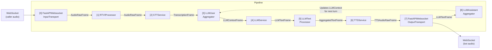

# Pipeline UML Class Diagram

The pipeline processors chained in order:

```python
pipeline = Pipeline([
    transport.input(),              # FastAPIWebsocketInputTransport
    rtvi,                           # RTVIProcessor
    stt,                            # STTService (e.g. DeepgramSTTService)
    context_aggregator.user(),      # LLMUserAggregator
    llm,                            # LLMService (e.g. OpenAILLMService)
    llm_text_processor,             # LLMTextProcessor
    tts,                            # TTSService (e.g. CartesiaTTSService)
    transport.output(),             # FastAPIWebsocketOutputTransport
    context_aggregator.assistant(), # LLMAssistantAggregator
])
```

---

## Class Diagram

```mermaid
classDiagram
    direction TB

    class FrameProcessor {
        -_prev: FrameProcessor
        -_next: FrameProcessor
        -_allow_interruptions: bool
        -_clock: BaseClock
        +process_frame(frame, direction)*
        +push_frame(frame, direction)
        +queue_frame(frame, direction)
        +link(processor)
        +setup(setup)
        +cleanup()
    }

    class AIService {
        -_model_name: str
        -_settings: dict
        +model_name: str
        +set_model_name(model)
        +start(frame)
        +stop(frame)
        +process_frame(frame, direction)
        +process_generator(generator)
    }

    class BaseInputTransport {
        -_params: TransportParams
        +start(frame)
        +stop(frame)
        +cancel(frame)
        +push_audio_frame(frame)
        +process_frame(frame, direction)
    }

    class BaseOutputTransport {
        -_params: TransportParams
        -_send_interval: float
        +start(frame)
        +stop(frame)
        +cancel(frame)
        +write_audio_frame(frame) bool
        +send_message(frame)
        +process_frame(frame, direction)
    }

    class FastAPIWebsocketInputTransport {
        -_client: FastAPIWebsocketClient
        -_params: FastAPIWebsocketParams
        -_initialized: bool
        +start(frame)
        +stop(frame)
        +cancel(frame)
        +process_frame(frame, direction)
    }
    note for FastAPIWebsocketInputTransport "Pipeline position: [0]\ntransport.input()\n\nReceives raw audio from WebSocket\nOutputs: AudioRawFrame ↓"

    class RTVIProcessor {
        -_config: RTVIConfig
        -_bot_ready: bool
        -_client_ready: bool
        +process_frame(frame, direction)
        +send_rtvi_message(message)
        +register_action(action)
        +set_bot_ready()
    }
    note for RTVIProcessor "Pipeline position: [1]\n\nHandles RTVI protocol messages\nPasses audio frames through"

    class STTService {
        -_sample_rate: int
        -_muted: bool
        -_audio_passthrough: bool
        +run_stt(audio)* AsyncGenerator
        +process_audio_frame(frame, direction)
        +process_frame(frame, direction)
        +set_language(language)
        +set_model(model)
    }
    note for STTService "Pipeline position: [2]\n\nInput: AudioRawFrame\nOutput: TranscriptionFrame ↓"

    class LLMUserAggregator {
        -_context: LLMContext
        -_user_messages: List~str~
        -_current_transcript: str
        +process_frame(frame, direction)
        +push_aggregation()
    }
    note for LLMUserAggregator "Pipeline position: [3]\ncontext_aggregator.user()\n\nInput: TranscriptionFrame\nAccumulates user text into LLMContext\nOutput: LLMContextFrame ↓"

    class LLMService {
        -_adapter: BaseLLMAdapter
        -_functions: dict
        +run_inference(context)* AsyncGenerator
        +process_frame(frame, direction)
        +register_function(name, handler)
    }
    note for LLMService "Pipeline position: [4]\n\nInput: LLMContextFrame\nGenerates response via LLM API\nOutput: LLMTextFrame ↓"

    class LLMTextProcessor {
        -_text_aggregator: BaseTextAggregator
        +process_frame(frame, direction)
        +reset()
    }
    note for LLMTextProcessor "Pipeline position: [5]\n\nInput: LLMTextFrame (word chunks)\nAggregates into sentences\nOutput: AggregatedTextFrame ↓"

    class TTSService {
        -_sample_rate: int
        -_muted: bool
        -_text_aggregator: BaseTextAggregator
        +run_tts(text)* AsyncGenerator
        +process_frame(frame, direction)
        +set_voice(voice)
        +set_language(language)
    }
    note for TTSService "Pipeline position: [6]\n\nInput: AggregatedTextFrame\nSynthesizes speech audio\nOutput: TTSAudioRawFrame ↓"

    class FastAPIWebsocketOutputTransport {
        -_client: FastAPIWebsocketClient
        -_params: FastAPIWebsocketParams
        -_next_send_time: float
        +start(frame)
        +stop(frame)
        +write_audio_frame(frame) bool
        +send_message(frame)
        +process_frame(frame, direction)
    }
    note for FastAPIWebsocketOutputTransport "Pipeline position: [7]\ntransport.output()\n\nInput: TTSAudioRawFrame\nSerializes and sends via WebSocket"

    class LLMAssistantAggregator {
        -_context: LLMContext
        -_assistant_messages: List~str~
        -_function_call_state: dict
        +process_frame(frame, direction)
        +push_aggregation()
    }
    note for LLMAssistantAggregator "Pipeline position: [8]\ncontext_aggregator.assistant()\n\nInput: LLMTextFrame (from upstream)\nAccumulates assistant response\ninto LLMContext for next turn"

    class Pipeline {
        -_processors: List~FrameProcessor~
        -_source: PipelineSource
        -_sink: PipelineSink
        +processors: List
        +setup(setup)
        +cleanup()
        +process_frame(frame, direction)
    }

    class LLMContext {
        -messages: List~dict~
        -tools: Any
        +add_message(message)
        +get_messages() List
        +set_tools(tools)
    }

    class LLMContextAggregatorPair {
        -_context: LLMContext
        -_user: LLMUserAggregator
        -_assistant: LLMAssistantAggregator
        +user() LLMUserAggregator
        +assistant() LLMAssistantAggregator
    }

    %% Inheritance
    FrameProcessor <|-- AIService
    FrameProcessor <|-- BaseInputTransport
    FrameProcessor <|-- BaseOutputTransport
    FrameProcessor <|-- RTVIProcessor
    FrameProcessor <|-- LLMTextProcessor
    FrameProcessor <|-- LLMUserAggregator
    FrameProcessor <|-- LLMAssistantAggregator
    FrameProcessor <|-- Pipeline

    AIService <|-- STTService
    AIService <|-- LLMService
    AIService <|-- TTSService

    BaseInputTransport <|-- FastAPIWebsocketInputTransport
    BaseOutputTransport <|-- FastAPIWebsocketOutputTransport

    %% Associations
    Pipeline o-- FastAPIWebsocketInputTransport : "[0] transport.input()"
    Pipeline o-- RTVIProcessor : "[1]"
    Pipeline o-- STTService : "[2] stt"
    Pipeline o-- LLMUserAggregator : "[3] context_agg.user()"
    Pipeline o-- LLMService : "[4] llm"
    Pipeline o-- LLMTextProcessor : "[5]"
    Pipeline o-- TTSService : "[6] tts"
    Pipeline o-- FastAPIWebsocketOutputTransport : "[7] transport.output()"
    Pipeline o-- LLMAssistantAggregator : "[8] context_agg.assistant()"

    LLMContextAggregatorPair --> LLMUserAggregator : creates
    LLMContextAggregatorPair --> LLMAssistantAggregator : creates
    LLMContextAggregatorPair --> LLMContext : owns

    LLMUserAggregator --> LLMContext : writes user messages
    LLMAssistantAggregator --> LLMContext : writes assistant messages
```



---

## Frame Flow Between Processors



---

## Processor Chain Detail

Each processor is linked to the next via `FrameProcessor.link()`. Frames flow `DOWNSTREAM` (left to right) during normal operation:

| Position | Class | Input Frame | Output Frame | Responsibility |
|----------|-------|-------------|--------------|----------------|
| 0 | `FastAPIWebsocketInputTransport` | Raw WebSocket bytes | `AudioRawFrame` | Deserializes Twilio media stream into audio frames |
| 1 | `RTVIProcessor` | `AudioRawFrame` | `AudioRawFrame` | Handles RTVI protocol; passes audio through |
| 2 | `STTService` | `AudioRawFrame` | `TranscriptionFrame` | Converts speech to text via provider API |
| 3 | `LLMUserAggregator` | `TranscriptionFrame` | `LLMContextFrame` | Accumulates user speech into conversation context |
| 4 | `LLMService` | `LLMContextFrame` | `LLMTextFrame` | Generates response text via LLM API |
| 5 | `LLMTextProcessor` | `LLMTextFrame` | `AggregatedTextFrame` | Aggregates word-level chunks into sentences |
| 6 | `TTSService` | `AggregatedTextFrame` | `TTSAudioRawFrame` | Converts text to speech audio via provider API |
| 7 | `FastAPIWebsocketOutputTransport` | `TTSAudioRawFrame` | WebSocket bytes | Serializes audio and sends to caller |
| 8 | `LLMAssistantAggregator` | `LLMTextFrame` | _(updates context)_ | Records assistant response in LLMContext for next turn |

---

## Inheritance Tree (Pipeline Processors Only)

```
FrameProcessor
├── BaseInputTransport
│   └── FastAPIWebsocketInputTransport    ← [0] transport.input()
├── RTVIProcessor                         ← [1] rtvi
├── AIService
│   ├── STTService                        ← [2] stt
│   ├── LLMService                        ← [4] llm
│   └── TTSService                        ← [6] tts
├── LLMUserAggregator                     ← [3] context_aggregator.user()
├── LLMTextProcessor                      ← [5] llm_text_processor
├── LLMAssistantAggregator                ← [8] context_aggregator.assistant()
├── BaseOutputTransport
│   └── FastAPIWebsocketOutputTransport   ← [7] transport.output()
└── Pipeline                              ← wraps all of the above
```


Pipeline class diagram as simple text:

Step 0: FastAPIWebsocketInputTransport

Class used: FastAPIWebsocketInputTransport

Inheritance: FastAPIWebsocketInputTransport → BaseInputTransport → FrameProcessor

What it does: Receives raw audio from the user via WebSocket.

Plain explanation: This is like the phone line answering your call and turning your voice into frames the system understands.

Output: AudioRawFrame


Step 1: RTVIProcessor

Class used: RTVIProcessor

Inheritance: RTVIProcessor → FrameProcessor

What it does: Handles RTVI protocol messages. Ensures the audio follows the bot’s messaging rules.

Plain explanation: A receptionist that checks the audio messages and forwards them without changing the content.

Output: AudioRawFrame


Step 2: STTService (Speech-to-Text)

Class used: STTService (example: DeepgramSTTService)

Inheritance: STTService → AIService → FrameProcessor

What it does: Converts audio frames into text.

Plain explanation: A transcription service that listens to your words and writes them down.

Output: TranscriptionFrame


Step 3: LLMUserAggregator

Class used: LLMUserAggregator

Inheritance: LLMUserAggregator → FrameProcessor

What it does: Collects user messages and builds conversation context (LLMContext).

Plain explanation: Like a notepad that remembers everything you’ve said so the AI can respond intelligently.

Output: LLMContextFrame


Step 4: LLMService (Language Model)

Class used: LLMService (example: OpenAILLMService)

Inheritance: LLMService → AIService → FrameProcessor

What it does: Reads the conversation context and generates a text response.

Plain explanation: The “brain” of the bot that decides what to say.

Output: LLMTextFrame


Step 5: LLMTextProcessor

Class used: LLMTextProcessor

Inheritance: LLMTextProcessor → FrameProcessor

What it does: Aggregates streamed word chunks into coherent sentences.

Plain explanation: A proofreader that turns fragmented words into full, readable sentences.

Output: AggregatedTextFrame


Step 6: TTSService (Text-to-Speech)

Class used: TTSService (example: CartesiaTTSService)

Inheritance: TTSService → AIService → FrameProcessor

What it does: Converts text into spoken audio.

Plain explanation: A voice synthesizer that turns the bot’s text response into speech you can hear.

Output: TTSAudioRawFrame


Step 7: FastAPIWebsocketOutputTransport

Class used: FastAPIWebsocketOutputTransport

Inheritance: FastAPIWebsocketOutputTransport → BaseOutputTransport → FrameProcessor

What it does: Sends audio frames back to the user via WebSocket.

Plain explanation: Like the phone line speaking the bot’s voice back to the caller.

Output: Audio bytes on WebSocket


Step 8: LLMAssistantAggregator

Class used: LLMAssistantAggregator

Inheritance: LLMAssistantAggregator → FrameProcessor

What it does: Stores the bot’s response in LLMContext for future turns.

Plain explanation: A memory keeper that remembers what the bot said so it can respond intelligently next time.

Output: Updates LLMContext